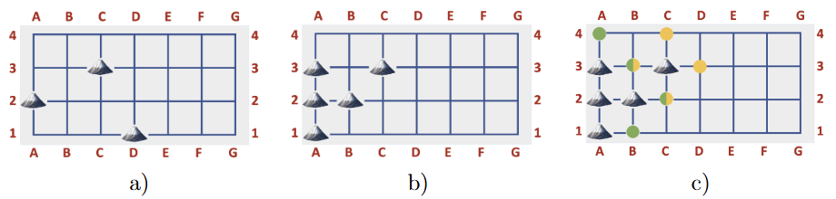

# 🏔️ Mountains-And-Valleys

In this project, the goal is to develop functions to obtain some information about the state of a rectangular territory formed by vertical and horizontal paths. Intersections can be empty or occupied by mountains, forming chains of mountains and surrounding valleys.

## 🗺️ Territory

A territory is a rectangular grid defined by vertical paths (A–Z) and horizontal paths (1–99).

### ➤ Intersection

An intersection is identified by where a horizontal and vertical path cross. Two intersections are **adjacent** if they are directly connected horizontally or vertically without other intersections in between.

All intersections are read left to right, bottom to top, and can be empty or occupied by mountains.

### ➤ Connection

Two occupied (or empty) intersections are **connected** if it is possible to trace a path between them passing only through other adjacent intersections with the same state (occupied or empty).

### ➤ Mountain Chains and Valleys

A **mountain chain** is a group of one or more connected intersections occupied by mountains and not connected to any other mountain. Similarly, a group of connected empty intersections forms a **chain of empty intersections**.

The **valley** of a mountain is the set of empty intersections adjacent to that mountain or to any mountain in the same chain.

---

## 🔍 Examples

Below are visual examples illustrating different configurations of the territory, mountain chains, and valleys:



**a)** Territory with three mountains in the intersections A2, C3 and D1.

**b)** Territory with two mountain chains: one with four mountains (A1, A2, B2, A3) and another with one mountain (C3).

**c)** Territory with the intersections of the mountain valley A1 (same for A2, B2 and A3) marked with a green dot and the intersections of the mountain valley C3 marked in yellow. The intersections C2 and B3 are part of the two valleys.

---

## ⚙️ How to Run

### ✅ 1. Check Python Installation

Make sure you have **Python 3** installed. To verify, open your terminal or command prompt and run:

```bash
python3 --version
```

If Python is installed, this will show the version number. If not, you can download it [here](https://www.python.org/downloads/).

### ✅ 2. Run the Program

Once Python is installed, you can run the program using the following command:

```bash
python3 FP2324P1.py
```

### ✅ 3. Run the Tests (Optional)

This repository includes two test files: `test_private.py` and `test_public.py`.

➤ Install **pytest** (if needed):

```bash
pip install pytest
```

➤ Run the tests:

```bash
pytest test_private.py
pytest test_public.py
```

## 📄 Project Description

You can find the full project description [here](https://github.com/maddie0120/Mountains-And-Valleys/blob/main/FP2324P1.pdf).
